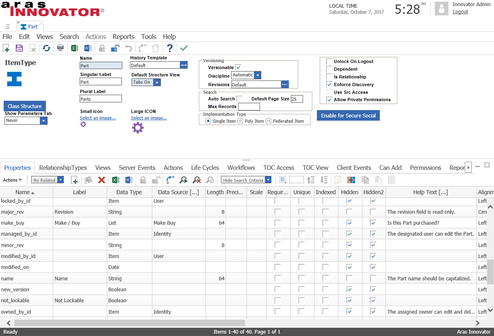
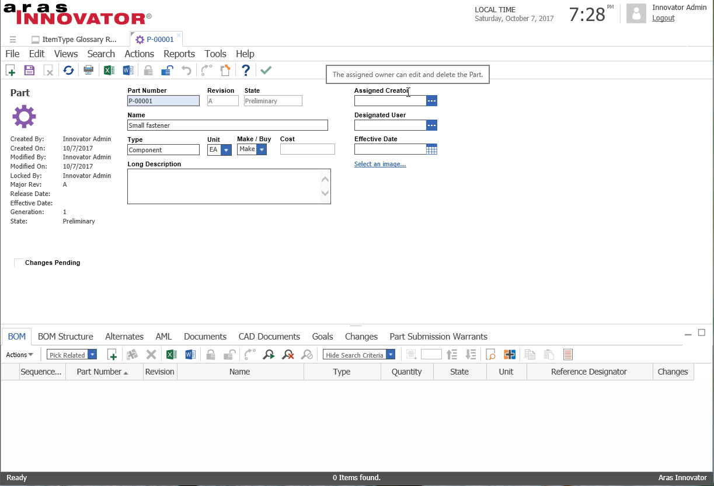
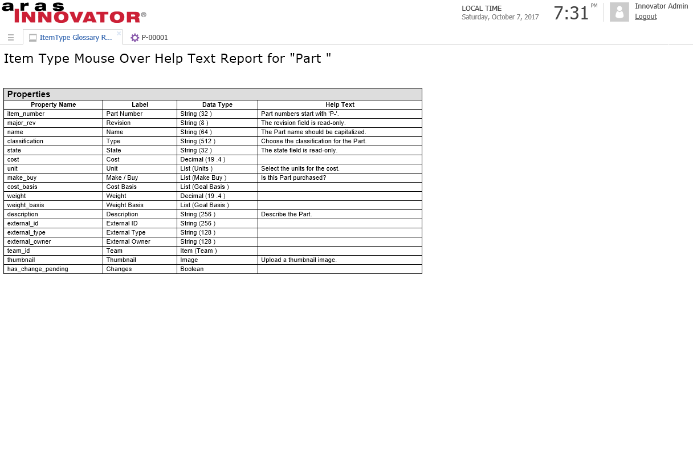

# Aras Mouse-Over Help

This project provides a method to display tooltips when hovering the mouse cursor over a form field.

## History

Release | Notes
--------|--------
[v1](https://github.com/ProcessPLM/Aras-Mouse-Over-Help) | First release

#### Supported Aras Versions

Project | Aras
--------|------
[v1](https://github.com/ProcessPLM/Aras-Mouse-Over-Help) | 11.0 SP9

## Installation

#### Important!
**Always back up your code tree and database before applying an import package or code tree patch!**

### Pre-requisites

1. Aras Innovator installed
2. Aras Package Import tool
3. **ArasMouseOverHelp** import package

### Install Steps

1. Backup your database and store the BAK file in a safe place.
2. Open up the Aras Package Import tool.
3. Enter your login credentials and click **Login**
    * _Note: You must login as root for the package import to succeed!_
4. Enter the package name in the TargetRelease field.
    * Optional: Enter a description in the Description field.
5. Enter the path to your local `imports.mf` file in the Manifest File field.
6. Select all in the Available for Import field.
7. Select Type = **Merge** and Mode = **Thorough Mode**.
8. Click **Import** in the top left corner.
9. Close the Aras Package Import tool.

## Usage

### Configure the mouseover text

*Note: The 'Help Text' column here has been repositioned. By default it's located on the right-hand side of the grid.*
1. Log in to Aras as admin.
2. Navigate to **Administration > ItemTypes** in the TOC and search for the ItemType you would like to add mouseover tips to.
3. Open the ItemType for editing.
4. For each property you want to have a mouseover tip, enter the tip text in the "Help Text" field.
5. Save the ItemType.

### Add the form event
6. Select the **Views** tab and open the ItemType's form for viewing.
7. Lock the form.
8. Select the **Form Events** tab.
9. Add a new OnFormPopulated form event with the FRM_SetHelpText method.
10. Save, unlock, and close the form.

### View the mouseover tips on an Item

Open an item that has mouseover tips configured and hover the cursor over a field. If a popup does not appear, log out and clear the browser cache. 

### View the ItemType Glossary report

*The ItemType Glossary Report displays the ItemType's properties and the configured mouseover help text.*

Select **Action > ItemType Glossary Report**. 

## Contributing

1. Fork it!
2. Create your feature branch: `git checkout -b my-new-feature`
3. Commit your changes: `git commit -am 'Add some feature'`
4. Push to the branch: `git push origin my-new-feature`
5. Submit a pull request

## Credits

Created by Darryl Poore.

